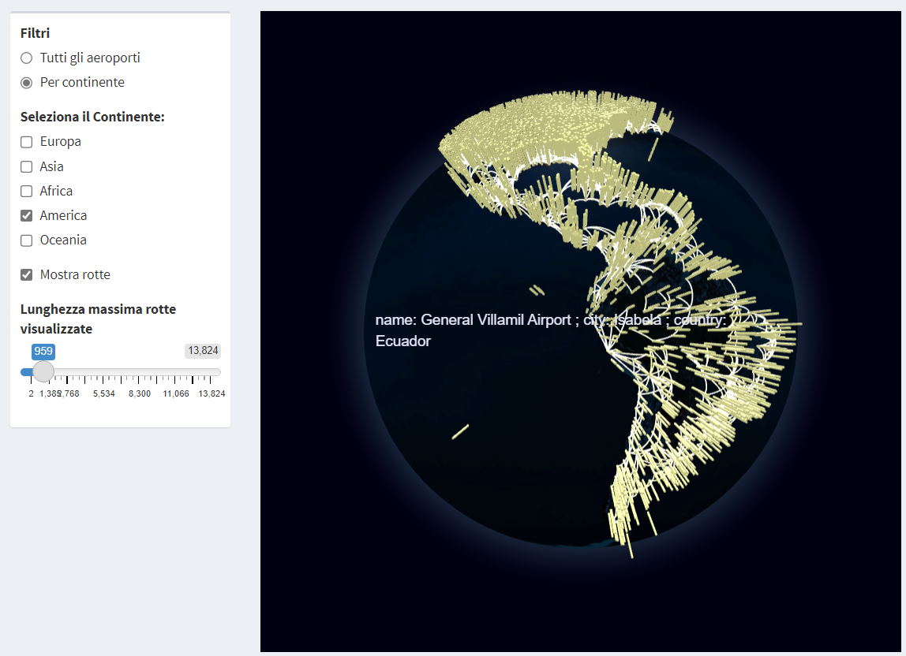

# FlightAnalyzer

**FlightAnalyzer** is a web application, written in R language, which allows the user to carry out various types of analysis regarding the global airport network.
The application was created as my Bachelor Degree thesis in Computer Science, at the University of Catania, under the supervision of the professor Micale Giovanni.

# Background

The airport network can be seen as a **graph**, where the nodes represent the different airports, while the arcs represent the air routes connecting different pairs of airports.

# Dataset
In order to simulate real data, I used the "[OpenFlights](https://openflights.org/data.html)" dataset, which contains information relating to routes, companies, airports, etc...

# Application Functionality

## Dashboard

The dashboard offers a summary report of the most important features of the graph, thus allowing to obtain an immediate overview of the structural properties and connectivity dynamics of the net.

### Network statistics
La prima parte della Dashboard permette di visualizzare informazioni di base riguardanti il grafo che rappresenta la rete aeroportuale. Tra queste informazioni abbiamo: 

• **Number of nodes and edges**: assortativity is a measure of the degree correlations of the nodes of a network. In general, it indicates the extent to which the vertices with the same properties connect to each other.

• **Clustering coefficent**: is a measure of the degree to which nodes in a graph tend to cluster together.

• **Assortativity**: is a preference for a network's nodes to attach to others that are similar in some way. Though the specific measure of similarity may vary, we examine assortativity in terms of a node's degree.

• **Number of triangles**: A triangle is a complete graph with 3 nodes and 3 edges.
Triangle analysis can be useful for studying the structure of the graph, including its density and the presence of clusters of nodes. In particular, the presence of numerous triangles may indicate a major cohesion or symmetry in the graph.

• **Average distance**

• **Diameter of the network**: the diameter of a graph is the length of the shortest path between the most distanced nodes.

• **Degree distribution**: the degree of a node in a network is the number of connections it has to other nodes, and the **degree distribution** is the probability distribution of these degrees over the whole network.

## Airport Research
One of the main features of the application is to allow the research of airports within the network, in order to obtain various informations about them.
The user is allowed to search for airports on the basis of different information about the airport you are looking for.
The possible search parameters are:
• IATA code
• ICAO code
• First name
• Nation
• Airlines operating in that airport

Based on the chosen parameters, the application will return:
• a list of network airports that satisfy the parameters inserted by the user;
• an interactive geographical map showing the locations geographical tions of the airports found. It is also possible to click on the map pins representing individual airports to get additional information on the latter;
• a list of airlines serving the airports found.

## 3D visualization of the network

In order to understand the structure of the airport network, it is very useful to have a simple and intuitive representation of the structure of the network. For this reason, a section of the FlightAnalyzer application is dedicated to the interactive 3D visualization of the network.
Through the use of the Globe4R library, a 3D globe is built, on the which PINs are placed at the different airports.
Various additional options that can be activated by the user are then made available:
• View all airports
• Visualization of the airports of specific continents
• Possibility to show the different sections, specifying a maximum value of length.

It is also possible to display various information regarding the individual airports of the network, simply by highlighting them with the mouse pointer.
The information displayed is in the specific name, city and state of the the highlighted airport.

## Centrality measures

Centrality measures are metrics used to quantify importance or the influence of a node within a graph. These measures are therefore aimed at identifying the nodes that have a somewhat significant role in the structure or operation of the network.

There are several measures of centrality, each of which takes an approach
different to evaluate the importance of the nodes. 
The following are implemented in the application:
• **Degree Centrality**;
• **Closeness Centrality**;
• **Betweeness Centrality**;
• **Page-Rank Centrality**.

## Motif search

**Motif search** is the most important part of the application.
Looking for a motif within a graph means finding a specific structure or pattern within the graph itself, which respects particular characteristics and repeats itself several times.
Motifs show recurring combinations of airports and routes that appear frequently, and they can be used for air route optimization and air traffic planning improvement.

### Steps of the motif search

1. **Motif creation**:   creation of the structure of the motif, with nodes and edges labels
2. **Motif search**:  the algorithm used for the search is [MultiMotif](https://alpha.dmi.unict.it/~gmicale/multiMotif/)
3. **Result visualization**: various information about the motifs are shown, such as number of occurrences, p-value, etc...
The application also creates a 3D globe that shows selected motifs

#### Motif creation

#### Motif search results

#### Visualization of the selected motifs

## Esempio di ricerca di motivi
In the following example we search a motif which represents an air route between Italy and Turkey, with a single intermediate stop in any country.
At the end, we select two random motifs and the application shows them in a 3D globe for a better visualization.

https://github.com/SalvoSamba01/FlightAnalyzer/assets/69872629/d81e0c7d-98e9-4251-87e6-99e796cf7af2

# How to use FlightAnalyzer
1. Download latest R and RStudio releases (Download [here](https://posit.co/download/rstudio-desktop/))
2. Download all files in the "app" directory
3. Run RStudio and install the following libraries with the command ***install.packages("library_name")***:
   a. *shiny*
   b. *shinydashboard*
   c. *igraph*
   d. *ggplot2*
   e. *ggmap*
   f. *maps*
   g. *geosphere*
   h. *leaflet*
   i. *DT*
   j. *visNetwork*
   k. *dplyr*
   l. *globe4r*
5. Execute the "app.R" file
6. Click the "Run app" button at the top ot the RStudio window
